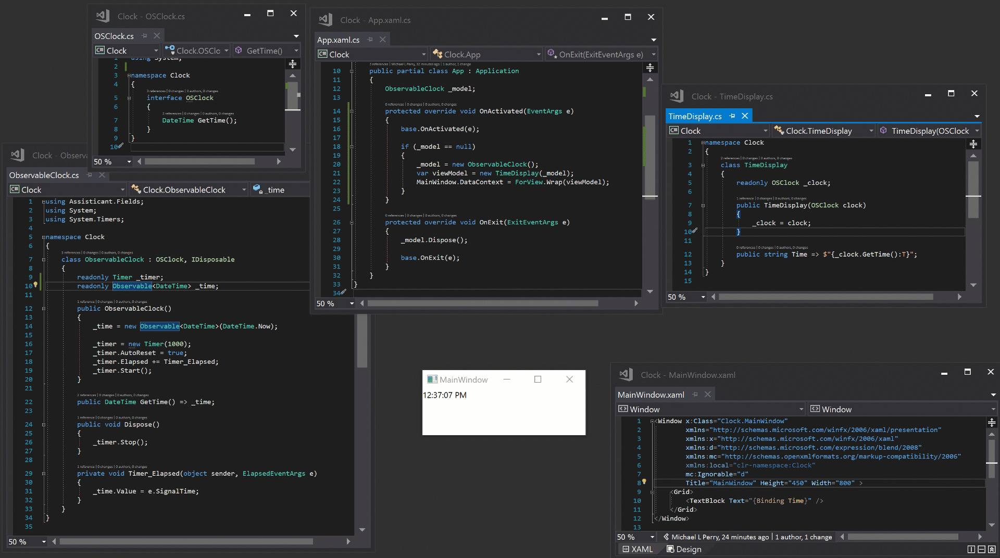

# Clock

Observable clock using Assisticant.



## Observable Clock

Create a class with an `Observable<DateTime>`. Expose the value via a property.

```csharp
class ObservableClock
{
    readonly Observable<DateTime> _time;

    public ObservableClock()
    {
        _time = new Observable<DateTime>(DateTime.Now);
    }

    public DateTime Time => _time;
}
```

Start a timer that periodically set the value of the observable.

```csharp
class ObservableClock
{
    readonly Timer _timer;
    readonly Observable<DateTime> _time;

    public ObservableClock()
    {
        _time = new Observable<DateTime>(DateTime.Now);

        _timer = new Timer(1000);
        _timer.AutoReset = true;
        _timer.Elapsed += Timer_Elapsed;
        _timer.Start();
    }

    public DateTime Time => _time;

    private void Timer_Elapsed(object sender, ElapsedEventArgs e)
    {
        _time.Value = e.SignalTime;
    }
}
```

## Time Display

Inject that object into a view model that will format the time as a string.

```csharp
class TimeDisplay
{
    readonly ObservableClock _clock;

    public TimeDisplay(ObservableClock clock)
    {
        _clock = clock;
    }

    public string Time => $"{_clock.Time:T}";
}
```

## Data Bind

Bind the property to a view. Wrap the view model so that Assisticant will raise `PropertyChanged` whenever the timer ticks.

```xaml
<Window x:Class="Clock.MainWindow"
        xmlns="http://schemas.microsoft.com/winfx/2006/xaml/presentation"
        xmlns:x="http://schemas.microsoft.com/winfx/2006/xaml"
        Title="Observable Clock" >
    <Grid>
        <TextBlock Text="{Binding Time}" />
    </Grid>
</Window>
```

```csharp
public partial class App : Application
{
    ObservableClock _model;

    protected override void OnActivated(EventArgs e)
    {
        base.OnActivated(e);

        if (_model == null)
        {
            _model = new ObservableClock();
            var viewModel = new TimeDisplay(_model);
            MainWindow.DataContext = ForView.Wrap(viewModel);
        }
    }
}
```

## Final Modifications

The source code in this repository has a few additional modifications:

- The `ObservableClock` implements an interface to reduce coupling of the view model on a particular implementation.
- The `ObservableClock` implements `IDisposable` and stops the timer.
- The application disposes of the clock on exit.
